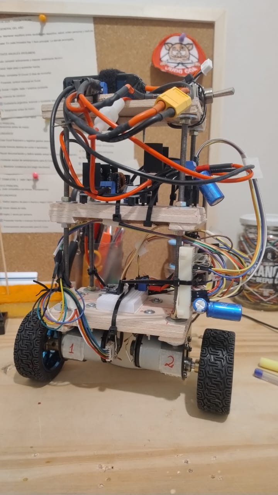
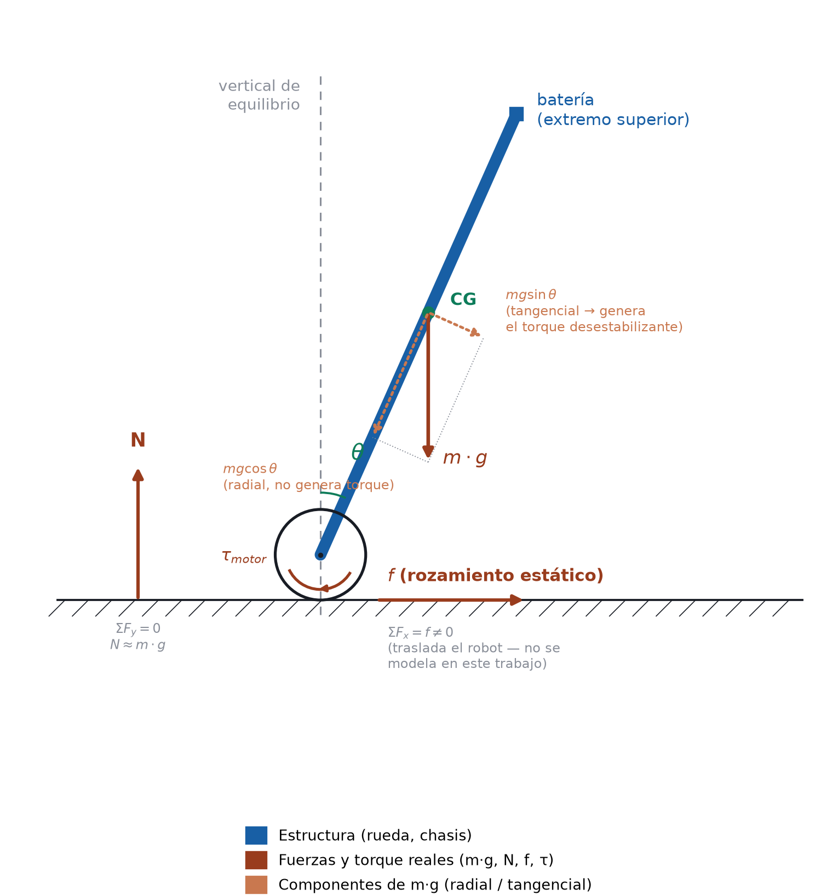
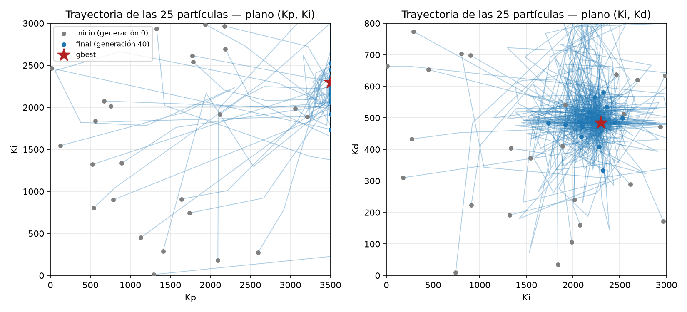
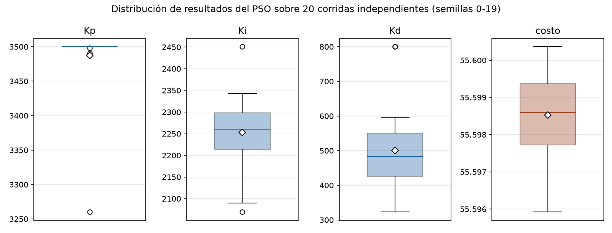

# Optimización de un controlador PID mediante PSO
## Aplicación: péndulo invertido de un robot balanceador real

**Materia**: Algoritmos Evolutivos I (2026) — Desafío Práctico
**Técnica**: Optimización por Enjambre de Partículas (PSO)
**Repositorio**: https://github.com/piertotumlocomotor/robot_balance (rama `develop`) — el notebook está en `notebooks/pso_pendulo_invertido.ipynb`

---



*El robot real sobre el que se midieron todos los parámetros físicos de este trabajo: tres niveles de madera de aeromodelismo, dos motorreductores con encoder (M1, M2) en espejo sobre el eje de las ruedas.*

## 1. El problema

Un robot balanceador de dos ruedas es, cerca de su posición vertical, un **péndulo invertido**: inestable a lazo abierto, requiere un controlador que lo corrija todo el tiempo. El controlador es un PID clásico — a partir del ángulo medido, calcula qué señal enviarle a los motores para volver a la vertical. Encontrar buenas ganancias (Kp, Ki, Kd) a mano es lento y poco sistemático: es optimización en un espacio continuo de 3 dimensiones sobre una función de costo sin forma cerrada (depende de simular la dinámica en el tiempo). **PSO** encaja bien: no necesita gradientes, tolera una función de costo no diferenciable (la nuestra tiene una penalización discontinua), y es simple de implementar y entender término a término.

Este trabajo no usa datos de ejemplo: **todos los parámetros físicos salen de mediciones directas** sobre un robot real (ESP32, MPU6050, motorreductores con encoder, driver L298N en modo *brake*). Buena parte del valor está en cómo se midieron esos parámetros y en los errores descartados en el camino (sección 4).

*Modo brake vs. coast: el L298N (puente H) puede dejar las salidas del motor en alta impedancia durante el tramo "apagado" del PWM (**coast**, decelera libre) o cortocircuitadas a masa (**brake**, frenado activo). Al mismo duty, brake entrega ~2.6× más torque — por eso el modelo usa parámetros medidos en brake.*

---

## 2. Marco teórico

### 2.1 El robot como péndulo invertido — diagrama de cuerpo libre

El robot se modela como un péndulo invertido sobre un eje de ruedas: masa distribuida a lo largo del cuerpo (motores cerca del pivote, batería arriba), un grado de libertad relevante — el ángulo θ.



El peso `m·g` (en el centro de masa, CG) se descompone, tomando la varilla pivote-CG como referencia, en **radial** (`m·g·cosθ`, sin brazo de palanca respecto al pivote, no genera torque) y **tangencial** (`m·g·sinθ`, sí tiene brazo de palanca — es la que produce el torque desestabilizante `m·g·l·sinθ`). La corrección la aporta `τ_motor`, transmitido al piso como una fuerza de **rozamiento estático** `f` (estático porque la rueda no patina — si patinara, no podría transmitir corrección). `N` es la reacción normal.

Separando ejes en el contacto rueda-piso: verticalmente hay equilibrio (`ΣFy=0`, `N≈m·g`), pero horizontalmente no (`ΣFx=f≠0`) — esa fuerza neta acelera al robot sobre el piso. Es la pista de que el eje de las ruedas **no es, en rigor, un pivote fijo**: se traslada. Este trabajo no modela esa traslación (licencia 2, abajo) — solo importa el ángulo — y por eso se puede medir `ω₀` colgando el robot de un pivote físicamente fijo (sección 4.7) y usar ese valor para el robot rodando: es la misma rotación alrededor del mismo eje.

### 2.2 Ecuación dinámica y las licencias que se toman al modelarlo

La ecuación no lineal completa incluye sinθ, cosθ y acoplamientos con las ruedas. Se linealiza en torno a θ=0 (sinθ≈θ) y se colapsa la dinámica de traslación/acoplamiento en dos constantes medibles sobre el robot real.

**De dónde sale.** El análogo rotacional de F=m·a es Στ = J·θ″. Sobre el robot actúan el torque de la gravedad (`m·g·l·sinθ`, desestabilizante, sección 2.1) y el de reacción del motor (`τ_motor(u)`, corrector):

```
J·θ″ = m·g·l·sinθ + τ_motor(u)
```

Linealizando y dividiendo por `J`: `θ″ = (m·g·l/J)·θ + τ_motor(u)/J`. El primer término define `ω₀² := m·g·l/J`; el segundo agrupa todo lo que depende del actuador en una constante medida, no derivada: `K_U·u_efectivo := τ_motor(u)/J`.

**Por qué "ω₀" y no "una constante k".** Resolviendo la ecuación libre (`θ″=ω₀²θ`) con `θ=e^(rt)`: `r²=ω₀²`, `r=±ω₀` — raíces **reales** (a diferencia del péndulo colgante clásico, `θ″=-ω₀²θ`, con raíces imaginarias y solución oscilante de período `T=2π/ω₀`; es la misma constante `m·g·l/J`, solo cambia el signo según el lado del equilibrio — y es exactamente el método usado para medir `ω₀`: colgar el robot y cronometrar el período, sección 4.7). La solución `θ(t)=A·e^(ω₀t)+B·e^(-ω₀t)` diverge dominada por `e^(ω₀t)`: `ω₀` es la tasa de ese crecimiento (en `1/ω₀` s, la desviación se multiplica por `e≈2.72`).

Con esas definiciones, la ecuación final:

```
θ″ = ω₀² · θ + K_U · u_efectivo
```

- **ω₀** (rad/s): tasa de inestabilidad (medido: 7.4 rad/s).
- **K_U** (rad/s² por duty): autoridad del actuador.
- **u_efectivo** (duty, -160 a 160): comando que efectivamente llega al motor — `u_pid` (2.4) después de zona muerta y saturación (2.3).

**Licencias explícitas:**

1. **Linealización**, válida hasta ~3-8° (sinθ y θ difieren <0.3%).
2. **Un solo grado de libertad**: el modelo completo tiene θ y la posición sobre el piso (licencia de la sección 2.1); acá solo importa θ, no que el robot se quede fijo en un punto. La inercia rotacional de las ruedas y la condición de rodadura tampoco se modelan aparte — quedan absorbidas en `K_U` (licencia 3).
3. **`K_U` agrupa toda la cadena de actuación** en una constante medida de punta a punta con balanza, evitando propagar error de cada parámetro intermedio.
4. **Asimetría entre motores, explícita, no promediada** (sección 4.3) — función escalón sobre `K_U` (sección 3.2).

### 2.3 El actuador real: zona muerta y saturación

- **Zona muerta**: el motor no responde por debajo de un umbral de duty (92 en M1, 102 en M2) — medido con balanza en todo el rango, no supuesto (sección 4.2/4.3).
- **Saturación**: cap de seguridad 160/255, de una caracterización térmica del driver (brake, ventana ~60s antes de riesgo térmico) — no un número elegido para el PSO.

Si el PSO optimizara contra un actuador ideal, encontraría ganancias que en la simulación se ven perfectas pero que el motor real jamás ejecuta.

### 2.4 Control PID

```
u_pid(t) = Kp·e(t) + Ki·∫e(t)dt + Kd·de(t)/dt
```

con `e(t)=θ(t)`. **Kp** reacciona al error presente, **Ki** elimina el residual acumulado, **Kd** anticipa y amortigua el sobreimpulso. Encontrar los tres a mano sobre un sistema con zona muerta y saturación es exactamente lo que se delega en PSO.

### 2.5 Por qué PSO

PSO optimiza una función de costo de caja negra (4s de dinámica no lineal simulada) sin necesitar derivada — la alternativa sin gradiente sería una búsqueda de grilla/aleatoria, mucho menos eficiente en 3D continuas. Cada partícula es un punto (Kp, Ki, Kd); el enjambre converge combinando inercia, atracción a su mejor histórico y al mejor global — sin derivar una función que ni siquiera es diferenciable (penalización discontinua, sección 3.3).

---

## 3. PSO — implementación y características

Implementado desde cero en NumPy puro, con la variante de **constricción de Clerc-Kennedy**:

```python
chi = 2 / |2 - φ - sqrt(φ² - 4φ)|,   φ = φ1 + φ2 = 4.1

v_i(t+1) = χ · (v_i(t) + φ1·r1·(pbest_i − x_i(t)) + φ2·r2·(gbest − x_i(t)))
x_i(t+1) = x_i(t) + v_i(t+1)
```

`i` identifica a la partícula (fija en el tiempo), `t` a la generación — por eso `x_i` se actualiza a `x_i(t+1)`, no a `x_(i+1)` (otra partícula distinta). `x_i` es la posición `(Kp,Ki,Kd)`, `v_i` su velocidad, `pbest_i`/`gbest` la mejor posición propia/del enjambre, `φ1,φ2` los pesos cognitivo/social, `χ` el factor de constricción.

**Por qué constricción**: en la variante original (Kennedy y Eberhart, 1995) la velocidad puede crecer sin límite, disparando partículas fuera del espacio de búsqueda. La solución clásica es un `Vmax` ajustado a mano por ensayo y error. `χ` resuelve lo mismo con un análisis matemático de estabilidad, sin ese hiperparámetro extra. Con `φ=4.1` (estándar de la literatura), `χ≈0.7298`.

**Configuración**: 25 partículas, 40 generaciones, semilla fija. Límites: Kp∈[0,3500], Ki∈[0,3000], Kd∈[0,800] (ampliados durante el desarrollo, sección 4.4). Las 40 generaciones son iteraciones del optimizador, no tiempo simulado — cada evaluación corre 4s de dinámica (sección 3.3), dos escalas de tiempo distintas.

### 3.1 Variables del robot real que entran al modelo

| Parámetro | Valor | Rol |
|---|---|---|
| ω₀ | 7.4 rad/s | Tasa de inestabilidad |
| K_U | 0.0218 rad/s² por duty | Autoridad del actuador |
| Zona muerta M1/M2 | 92/102 duty | Umbral de `k_u_efectivo` |
| MAX_DUTY | 160 | Saturación |
| ESCENARIOS (ángulo) | 1.5°/2.0°/3.0° | Rango real medido |
| ESCENARIOS (velocidad) | −0.15/0/+0.15 rad/s | Acotado por el método de medición |

Los ángulos cubren el rango real de perturbación (media 1.98°, peor caso 3.06°, n=22 — Test 10: parar el robot a mano, sin estímulo externo). Las velocidades salen del mismo test: solo captura una muestra con giroscopio <0.15 rad/s ("quieto"), así que ninguna muestra real supera esa velocidad en el instante que importa.

### 3.2 La asimetría entre motores, modelada como dos zonas muertas

M1 responde desde ~92/255, M2 desde ~102/255. Una sola zona muerta ignora la franja de 10 puntos donde uno empuja y el otro no:

```python
def k_u_efectivo(u_abs):
    if u_abs < DEAD_ZONE_M1:   return 0.0     # ningun motor responde
    elif u_abs < DEAD_ZONE_M2: return PROP_M1  # solo M1 (57.5% del K_U total)
    else:                      return 1.0      # los dos motores
```

`PROP_M1 = 0.575` sale de la razón de torque M2/M1 medida (~0.74): `1/(1+0.74)`.

### 3.3 Función de costo

Variante de **ITAE** (Integral of Time-weighted Absolute Error, también llamada "aptitud"/"fitness" en la literatura — acá se minimiza, así que "mejor" es "menor"), con penalización de 500 si el péndulo termina caído (>30°):

```python
costo = promedio_sobre_escenarios( Σ t·|θ(t)|·dt  +  500 si |θ_final| > 30° )
```

Los dos números son deliberadamente holgados, no un ajuste fino: `30°` es ~10× la peor perturbación real (3.06°) y muy por fuera de donde vale la linealización. `500` domina el costo de cualquier trayectoria exitosa (ITAE típico 0.03-0.10) por más de 5000×, para que fallar un escenario nunca compita con ser un poco más lento en los otros ocho. Se promedia sobre 9 escenarios (3 ángulos × 3 velocidades), no uno solo (motivo en sección 4.1).

### 3.4 Resultados

**Ganancias óptimas**: `Kp=3500.00`, `Ki=2297.02`, `Kd=484.22`, costo final `55.5973`.


*(panel derecho: el mismo dato, como excedente sobre el piso teórico en escala log — más claro para ver que los tres saltos de mejora, en generación ~1, ~2 y ~7, son reales)*

La convergencia es casi inmediata (generación ~7) y luego plana, porque el costo tiene un **piso teórico**. El ITAE nunca es negativo, y el escenario 9 (θ=3°, v=+0.15 rad/s) paga la penalización de 500 sin importar las ganancias (límite físico del actuador, sección 4.6) — así que:

```
costo = (ITAE₁+...+ITAE₈+ITAE₉+500)/9 ≥ (0+...+0+500)/9 = 500/9 ≈ 55.56
```

El óptimo encontrado está a <0,1% de ese piso — casi no queda margen de mejora una vez resueltos los 8 escenarios fáciles (ITAE entre 0.026 y 0.041 cada uno; el noveno aporta 0.098 + la penalización completa; el promedio da exactamente 55.5973).

**Cómo converge el enjambre, no solo el costo**: instrumentando una copia del algoritmo que guarda la posición de las 25 partículas por generación (mismo resultado verificado, 55.5973):



Las partículas arrancan dispersas por todo el espacio y terminan agrupadas cerca del óptimo — en (Kp,Ki) migran al borde Kp=3500 (sección 4.5); en (Ki,Kd) se ve el embudo hacia (Ki≈2300, Kd≈480). Es la misma razón del piso teórico: la superficie de costo es casi plana lejos de la zona muerta, así que un punto de partida lejano no cuesta mucho más que uno cercano.


Con θ₀=2° (la media real), el ángulo decae a 0° en ~3,5-4s. Dos detalles: (1) **no es que el motor tarde en reaccionar** — con Kp=3500 el comando cruza la zona muerta casi de inmediato, pero queda oscilando en su borde (patrón *bang-bang*, sección 4.5) en vez de ir a fondo de escala, así que la corrección promedio es "a media máquina"; (2) **el comando se ve siempre negativo** porque en esta trayectoria puntual θ nunca cruza el cero dentro de los 4s (`u_motor=-u_pid`) — no es una propiedad general.

**Verificación escenario por escenario** (sección 4.6): de 9, **8 estabilizan limpio**. El que no — θ=3°, v=+0.15 rad/s — combina el peor ángulo medido con una velocidad que ya empeora esa posición (velocidad positiva con ángulo positivo = ya se está inclinando más). El controlador solo, con θ=3°, llega a tiempo (queda margen hasta el umbral de 3.65°, sección 4.6); con la velocidad sumada, el ángulo cruza ese umbral *antes* de que el controlador reaccione, y entra en la misma divergencia exponencial `e^(ω₀t)` derivada en 2.2 — sin vuelta atrás (termina en 60.158°, el tope de simulación). El escenario gemelo con v=−0.15 rad/s sí se resuelve: esa velocidad ya apunta hacia la vertical, a favor del controlador.

### 3.5 Repetibilidad entre corridas independientes

Repitiendo el entrenamiento 20 veces con semillas distintas:



El costo final es prácticamente idéntico (coef. de variación 0,002%) — consistente con estar pegado al piso teórico. `Kp` pega en 3500 en 19/20 corridas (la excepción, 3260, confirma que no hay óptimo interior — sección 4.5). `Ki` y `Kd` sí varían más entre semillas sin que el costo cambie: la superficie de costo es plana en esas direcciones, hay una franja ancha de combinaciones casi igual de buenas.

---

## 4. Inconvenientes encontrados y cómo se resolvieron

El problema no fue "correr PSO" (directo), fue construir un modelo cuyos parámetros y función de costo representaran honestamente al sistema real, y detectar cuándo no lo hacían.

### 4.1 El costo de una sola condición inicial era engañoso

Evaluar cada partícula con una única condición inicial dejaba el costo dominado por el ruido caótico de temporización de la zona muerta: cambios de 0.08% en `Kd` empeoraban el costo 6.6×. **Solución**: promediar sobre 9 escenarios — la sensibilidad local bajó de ~660% a ~15%.

### 4.2 Medir K_U: dos vías fallidas antes de la que funcionó

`K_U` no se mide con una regla. Inferirlo de la caída de tensión del L298N (multímetro) falló dos veces por método (asumir 0V en el tramo apagado del PWM; asumir una caída constante, que tampoco lo era — el driver degrada su salida al calentarse). Se midió **el torque directo con balanza**: con los dos motores conduciendo a la vez, el torque de cada uno cae 31-36% respecto de medirlo solo — el robot balancea con los dos activos siempre, así que ese es el número que corresponde, no el de un motor aislado.

### 4.3 La zona muerta no es un número — son dos, distintos

La misma medición reveló que los motores no arrancan al mismo duty. El valor único usado antes ("al aire, sin carga") tampoco correspondía a la condición real, donde ambos umbrales suben (sección 3.2).

### 4.4 El límite de búsqueda de Kp — y después el de Ki, y el de Kd

`K_U` más chico que lo asumido sube el umbral teórico `Kp > ω₀²/K_U` de ~1827 a ~2512 — por encima del límite viejo del PSO (2000). Al ampliarlo, Kp volvió a pegarse al nuevo límite; al ampliar el de Ki, Ki encontró óptimo interior pero Kd se pegó al suyo; al ampliar Kd, los tres se estabilizaron (sección 4.5 explica por qué era esperable).

### 4.5 Por qué Kp no tiene óptimo interior en este modelo (y Ki, Kd sí)

Con la zona muerta ocupando gran parte del rango, un error chico produce un comando que no mueve ningún motor. Mayor Kp cruza antes ese umbral — y como el comando además satura, subir Kp no tiene costo en este modelo, solo lo acerca a *bang-bang*, óptimo para ITAE. Un barrido confirma costo monótono decreciente, sin mínimo interior. Que Ki y Kd sí tengan óptimo interior confirma que el problema es específico de Kp: Ki muy grande genera sobreimpulso e integral *windup* (ITAE sí lo penaliza), igual Kd con el ruido de la derivada. **La función de costo está incompleta para Kp, no el resultado está mal** — un término que penalice la frecuencia de conmutación daría un óptimo con sentido físico (extensión natural del trabajo).

### 4.6 Un escenario no se resuelve — y confirma, por un camino independiente, el mismo límite medido con la balanza

El escenario más exigente (3.0°, +0.15 rad/s) termina en caída completa sin importar cuánto se amplíen las ganancias. No es falta de búsqueda: es un límite de autoridad del actuador. Con el comando saturado, la corrección disponible es `K_U·MAX_DUTY≈3.49 rad/s²`; el término desestabilizante a 3° ya es `ω₀²·3°≈2.87 rad/s²` — margen de `0.62 rad/s²`, que se agota en:

```
θ_umbral = K_U·MAX_DUTY / ω₀² ≈ 3.65°
```

Dentro de un 0.3%, es el mismo 3.66° que había cerrado la medición directa de torque con balanza esa misma noche — dos caminos independientes (simulación vs. torque medido) al mismo número. No es coincidencia buscada: es la misma física, vista dos veces. El sistema físico, con este actuador, tiene un límite de perturbación recuperable apenas por encima del peor caso real medido — margen positivo (~20%) en general, sin margen solo en la combinación más severa de ángulo y velocidad simultáneos.

### 4.7 Una lección de método que se repitió tres veces

Medir `ω₀` costó tres intentos: los dos primeros, repetibles (dispersión 0.8% y 1.5%), medían la cantidad equivocada (un péndulo doble sin saberlo; el robot colgando de un brazo humano en vez de un pivote rígido). Lo que los distinguió del valor correcto no fue la dispersión, sino un chequeo físico de una línea: `L_eq = g·(T/2π)²` tiene que ser del orden del tamaño del robot (26 cm) — solo 7.4 rad/s lo cumple. El mismo patrón volvió con `K_U` y con el escenario 9. **La lección: la repetibilidad mide la estabilidad de un montaje, no la validez de lo que mide** — lo que valida es un chequeo independiente contra una física que tiene que cerrar.

---

## 5. Conclusiones

- Se implementó PSO desde cero (constricción de Clerc-Kennedy) para optimizar un PID sobre un modelo de péndulo invertido construido enteramente con datos medidos, no supuestos.
- Construir el modelo fue más largo e instructivo que correr el algoritmo: `ω₀`, `K_U` y la función de costo pasaron por fallas de método identificadas y corregidas con causa raíz documentada, no solo el número final.
- Las ganancias encontradas (`Kp=3500`, `Ki=2297.02`, `Kd=484.22`) estabilizan 8 de 9 escenarios de diseño. El que no se resuelve no es un fallo del algoritmo — es un límite físico de torque, y la simulación lo reproduce de forma independiente casi exacta (3.65° vs. 3.66° medido), lo que da confianza en que el modelo captura la física que importa.
- Trabajo futuro: un término de costo que penalice la frecuencia de conmutación (Kp con óptimo interior físico), y validar contra el robot real cuando el driver se reemplace por uno con más margen de torque.
