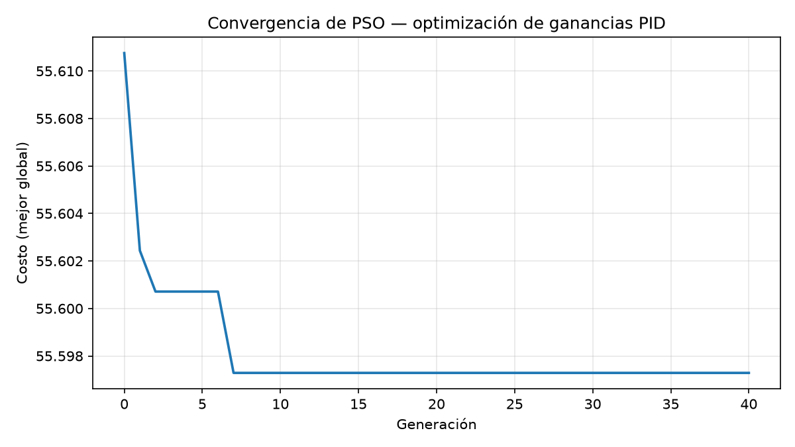
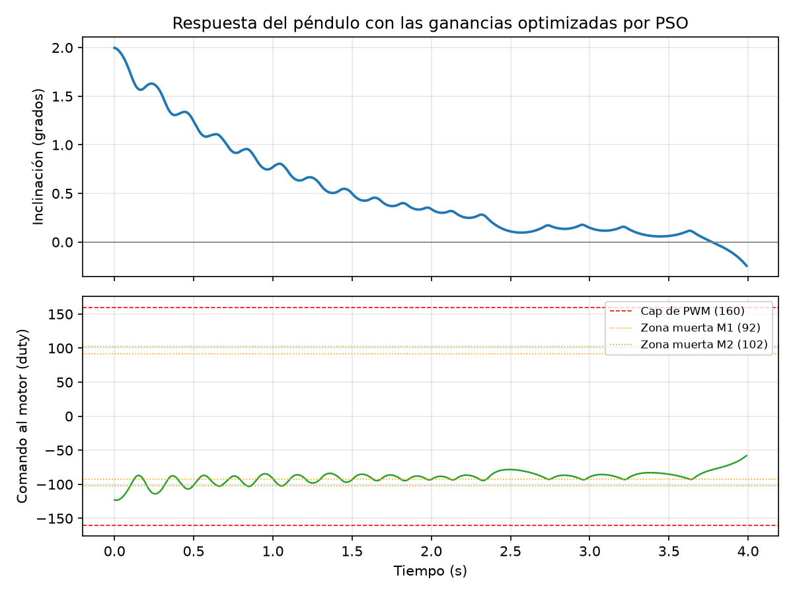

# Optimización de un controlador PID mediante PSO
## Aplicación: péndulo invertido de un robot balanceador real

**Materia**: Algoritmos Evolutivos I (2026) — Desafío Práctico
**Técnica**: Optimización por Enjambre de Partículas (PSO)
**Repositorio**: _(completar con la URL antes de entregar)_

---

## 1. El problema

Un robot balanceador de dos ruedas es, en la vecindad de su posición vertical, un **péndulo invertido**: un sistema inestable a lazo abierto que un controlador tiene que corregir constantemente para no caer. El controlador es un PID clásico — a partir del ángulo de inclinación medido, calcula cuánto comandarle a los motores para volver a la vertical.

Encontrar buenas ganancias (Kp, Ki, Kd) a mano es lento y poco sistemático: es un problema de optimización en un espacio continuo de tres dimensiones, sobre una función de costo que no tiene forma cerrada — depende de simular la respuesta dinámica del sistema en el tiempo, y esa simulación en sí misma no es trivial de definir bien (ver sección 3.4). Es un caso de uso natural para un algoritmo de optimización basado en población, y en particular para **PSO**: no necesita gradientes, tolera una función de costo no diferenciable (la nuestra tiene una penalización discontinua), y su implementación es lo bastante simple como para escribirla desde cero y entender cada término.

Este trabajo no usa un problema de juguete ni datos de ejemplo: **todos los parámetros físicos del modelo salen de mediciones directas** sobre un robot balanceador real, construido para este propósito (ESP32, MPU6050, motorreductores con encoder, driver L298N en modo *brake*). Buena parte del valor del trabajo está, de hecho, en cómo se midieron esos parámetros y en los errores que hubo que descartar en el camino — se detalla en la sección 4.

---

## 2. Marco teórico

### 2.1 El robot como péndulo invertido — diagrama de cuerpo libre

El robot se modela como un péndulo invertido montado sobre un eje de ruedas: la masa está distribuida a lo largo del cuerpo (motores cerca del pivote, batería en el extremo superior), y el sistema tiene un único grado de libertad relevante para este análisis — el ángulo de inclinación θ respecto de la vertical.

```
                    ╷ batería (extremo superior)
                    │
              θ →  ╱│  ← cuerpo del robot (26 cm)
                  ╱ │
                 ╱  │  ┄┄┄ vertical de equilibrio
                ╱   │
               ╱    │
          ────●─────┴──── piso
            eje de las
             ruedas
              (pivote)

  Fuerzas sobre el cuerpo:
    m·g      →  peso, aplicado en el centro de masa
    N        →  reacción normal del piso, en el contacto rueda-piso
    f        →  fuerza de tracción horizontal, en el contacto rueda-piso
    τ_motor  →  torque de reacción del motor sobre el eje
```

Sobre el eje de las ruedas actúa el peso (que genera el torque desestabilizante, proporcional a sinθ) y el torque de reacción del motor (la única fuerza de corrección disponible). La fuerza de tracción en el contacto rueda-piso es la que efectivamente traslada el torque del motor en una aceleración angular del cuerpo — es el acoplamiento entre "cuánto le pido al motor" y "cuánto se endereza el robot", y es exactamente lo que el parámetro `K_U` del modelo representa.

### 2.2 Ecuación dinámica y las licencias que se toman al modelarlo

La ecuación no lineal completa de un péndulo invertido incluye términos en sinθ, cosθ y acoplamientos con la dinámica de las ruedas. Se linealiza en torno a θ=0 (ángulos chicos, sinθ≈θ) y se colapsa toda la dinámica de traslación/acoplamiento rueda-cuerpo en dos constantes medibles directamente sobre el robot real:

```
θ'' = ω₀² · θ + K_U · u_efectivo
```

- **ω₀** (rad/s): la tasa de inestabilidad — qué tan rápido crece el ángulo sin control. Sale de tratar al robot como un péndulo físico simple: `ω₀² = m·g·l / J`, con `l` la distancia del pivote al centro de masa y `J` el momento de inercia.
- **K_U** (rad/s² por unidad de duty): la autoridad del actuador — cuánta aceleración angular de corrección produce una unidad de comando al motor.
- **u_efectivo**: el comando PID después de pasar por las no linealidades reales del actuador (zona muerta, saturación) — sección 2.3.

**Licencias tomadas, explícitas:**

1. **Linealización.** Válida mientras θ se mantenga chico (el modelo se usa hasta ~3-8°, donde sinθ y θ difieren menos del 0.3%).
2. **Un solo grado de libertad.** Se ignora la dinámica de las ruedas girando (no hay término de velocidad lineal del robot ni de las ruedas como estado separado) — el par motor se traduce directo en aceleración angular del cuerpo vía `K_U`, sin modelar el acoplamiento rueda-suelo-cuerpo por separado. Es razonable para evaluar la estabilización del ángulo en el corto plazo (segundos), que es lo que este trabajo optimiza; no sería suficiente para modelar desplazamiento del robot en el piso.
3. **`K_U` agrupa toda la cadena de actuación** (motor, reductora, rueda, contacto con el piso, masa y geometría del robot) en una única constante, medida de punta a punta con una balanza en vez de derivada de parámetros individuales (constante de torque del motor, radio de rueda, etc.) — más simple y, sobre todo, **medible directamente** sin errores de propagación de cada parámetro intermedio.
4. **Dos motores, tratados con una asimetría explícita, no promediados.** El robot tiene dos ruedas motrices que no son mecánicamente idénticas (sección 4.3) — en vez de promediarlas en un único actuador simétrico, el modelo representa la asimetría como una función escalón sobre `K_U` (sección 3.2).

### 2.3 El actuador real: zona muerta y saturación

Un PID de libro asume un actuador lineal sin límites. El motor real de este robot:

- **No responde en absoluto** por debajo de un umbral de duty PWM (zona muerta, distinta para cada uno de los dos motores — sección 4.3).
- **Nunca supera un cap de seguridad** de PWM, fijado por el driver y una ventana térmica operativa (sección 4.4).

Si el PSO optimizara contra un actuador ideal, podría encontrar ganancias que en la simulación se ven perfectas pero que en el robot real piden correcciones que el motor jamás ejecuta. Por eso estas dos no linealidades están dentro del modelo simulado desde el principio.

### 2.4 Control PID

El controlador calcula el comando al motor como

```
u_pid(t) = Kp·e(t) + Ki·∫e(t)dt + Kd·de(t)/dt
```

con `e(t) = θ(t)` (el punto de equilibrio es θ=0). Cada término cumple un rol distinto: **Kp** reacciona al error presente, **Ki** elimina el error residual acumulado en el tiempo, **Kd** anticipa hacia dónde va el error y amortigua el sobreimpulso. Encontrar la combinación correcta de los tres a mano, sobre una planta con zona muerta y saturación (que vuelven el sistema no lineal), es exactamente el problema que se delega en PSO.

### 2.5 Por qué PSO

PSO optimiza una función de costo de caja negra (acá, el resultado de simular 4 segundos de dinámica no lineal) sin necesitar su derivada — la única alternativa clásica sin gradiente hubiera sido una búsqueda de grilla o aleatoria, mucho menos eficiente en 3 dimensiones continuas. Cada partícula es un punto (Kp, Ki, Kd); el enjambre converge combinando la inercia de cada partícula con la atracción hacia su mejor posición histórica y hacia la mejor posición global — sin necesitar calcular ninguna derivada de la función de costo, que en este caso ni siquiera es diferenciable (tiene una penalización discontinua, sección 3.3).

---

## 3. PSO — implementación y características

Implementado desde cero en NumPy puro (sin librerías de optimización), con la variante de **constricción de Clerc-Kennedy**:

```python
chi = 2 / |2 - φ - sqrt(φ² - 4φ)|,   φ = φ1 + φ2 = 4.1

v_i ← χ · (v_i + φ1·r1·(pbest_i − x_i) + φ2·r2·(gbest − x_i))
x_i ← x_i + v_i
```

Se eligió sobre la variante clásica con límite de velocidad ajustado a mano porque el factor de constricción garantiza convergencia (matemáticamente, no por ensayo y error) sin ese hiperparámetro extra.

**Configuración**: 25 partículas, 40 generaciones, semilla fija para reproducibilidad. Límites de búsqueda: Kp∈[0,3500], Ki∈[0,3000], Kd∈[0,800] — ampliados varias veces durante el desarrollo (sección 4.5) hasta confirmar que no estaban recortando el óptimo real.

### 3.1 Variables del robot real que entran al modelo — y cómo

| Parámetro | Valor | Rol en el modelo |
|---|---|---|
| ω₀ | 7.4 rad/s | Tasa de inestabilidad — coeficiente del término θ en la dinámica |
| K_U | 0.0218 rad/s² por duty | Autoridad del actuador — coeficiente del término de comando |
| Zona muerta M1 / M2 | 92 / 102 duty | Umbral de la función escalón `k_u_efectivo` (sección 3.2) |
| MAX_DUTY | 160 | Saturación del comando |
| ESCENARIOS (ángulo) | 1.5° / 2.0° / 3.0° | Condiciones iniciales de la simulación — rango real medido |
| ESCENARIOS (velocidad) | −0.15 / 0 / +0.15 rad/s | Condiciones iniciales — acotadas por el propio método de medición del ángulo |

### 3.2 La asimetría entre motores, modelada como dos zonas muertas

Los dos motores no son iguales: M1 empieza a responder en ~92/255 duty, M2 recién en ~102/255. Modelarlos con una única zona muerta sobre-simplifica la franja de 10 puntos donde un motor ya empuja y el otro todavía no. Se representa con una función de dos escalones:

```python
def k_u_efectivo(u_abs):
    if u_abs < DEAD_ZONE_M1:   return 0.0     # ningun motor responde
    elif u_abs < DEAD_ZONE_M2: return PROP_M1  # solo M1 (57.5% del K_U total)
    else:                      return 1.0      # los dos motores
```

`PROP_M1 = 0.575` sale de la razón de torque M2/M1 medida en el robot real (~0.74): M1 aporta `1/(1+0.74)` del total cuando es el único que está por encima de su umbral.

### 3.3 Función de costo

Variante de **ITAE** (Integral of Time-weighted Absolute Error): penaliza más el error que persiste en el tiempo que el error inicial, que es inevitable. Si el péndulo termina caído (>30° al final de la ventana de simulación), se suma una penalización fija de 500 — un controlador que no estabiliza no es "peor", es inválido.

```python
costo = promedio_sobre_escenarios( Σ t·|θ(t)|·dt  +  500 si |θ_final| > 30° )
```

**Se promedia sobre 9 escenarios** (3 ángulos × 3 velocidades iniciales), no uno solo — motivo detallado en la sección 4.2.

### 3.4 Resultados

**Ganancias óptimas encontradas**: `Kp = 3500.00`, `Ki = 2297.02`, `Kd = 484.22`, costo final `55.60`.

**Gráfico de convergencia** (`convergencia_pso.png`):



La convergencia es casi inmediata (generación ~7) y luego plana. Esto es consistente con la forma del costo: como se explica en la sección 4.6, `Kp` no tiene óptimo interior en este modelo — el enjambre lo empuja al límite superior del espacio de búsqueda casi de inmediato, y una vez ahí, ajustar Ki y Kd es un problema mucho más simple y de convergencia rápida.

**Respuesta temporal con las ganancias óptimas** (`respuesta_pid_optimo.png`), condición inicial θ₀=2° (la media real medida):



El ángulo decae suavemente hacia 0°, y el comando al motor se mantiene siempre dentro del cap de seguridad (±160), oscilando cerca de la zona muerta — el patrón de conmutación *bang-bang* que se explica en la sección 4.6.

**Verificación escenario por escenario** (no solo el costo promedio — ver por qué en la sección 4.7): de los 9 escenarios de diseño, **8 estabilizan limpio**. Uno no — el peor caso combinado (3.0° con velocidad +0.15 rad/s) — y la sección 4.7 explica por qué eso es un límite físico real del actuador, no una falla del algoritmo.

---

## 4. Inconvenientes encontrados y cómo se resolvieron

Esta sección es, en varios sentidos, el contenido más sustancial del trabajo — el problema no fue "correr PSO" (eso es directo), fue construir un modelo cuyos parámetros y cuya función de costo representaran honestamente al sistema real, y detectar cuándo no lo estaban haciendo.

### 4.1 Un artefacto numérico que parecía un resultado

La primera versión de la simulación integraba la física con Euler simple a 100 Hz y calculaba la derivada del PID como una diferencia finita cruda. Con el paso de integración chico, esa derivada amplifica el ruido de discretización por un factor `1/dt = 100`: ganancias casi idénticas (`Kd=82.72` vs. `83.00`, 0.3% de diferencia) daban resultados opuestos — una estabilizaba, la otra hacía caer el péndulo. El PSO estaba optimizando ruido numérico, no una propiedad real del sistema.

**Solución** (dos prácticas estándar de PID digital real): sub-pasos de integración de la física más finos que el muestreo del lazo de control, y un filtro pasa-bajos exponencial sobre la derivada antes de multiplicarla por `Kd`.

### 4.2 El costo de una sola condición inicial era engañoso

Aun con la física corregida, evaluar cada partícula con una única condición inicial dejaba el costo dominado por el ruido caótico de temporización de la zona muerta: el instante exacto en que el comando la cruza cambia toda la trayectoria posterior, y cambios de 0.08% en `Kd` empeoraban el costo 6.6×. El PSO se enganchaba a puntos "afortunados", no a controladores genuinamente mejores.

**Solución**: promediar el costo sobre 9 escenarios (3 ángulos × 3 velocidades). La sensibilidad local bajó de ~660% a ~15%.

### 4.3 Medir K_U: dos vías fallidas antes de la que funcionó

`K_U` no se puede medir con una regla — es la autoridad de corrección de todo el sistema de actuación junto. El primer intento fue inferirlo de la caída de tensión del L298N con un multímetro. Falló dos veces por razones de método distintas: un modelo que asumía tensión cero en el tramo apagado del PWM, y después uno que asumía una caída constante que tampoco lo era (el driver degrada su propia salida al calentarse). Se abandonó la vía indirecta y se midió **el torque directo con una balanza**.

Ahí apareció el hallazgo que más cambió el resultado: **con los dos motores conduciendo a la vez, el torque de cada uno cae 31-36% respecto de medirlo solo.** El robot balancea con los dos motores activos siempre — ese es el número que corresponde, no el de un motor aislado (que hubiera dado un `K_U` casi el doble de optimista, y unas ganancias PID afinadas para una planta que no existe).

### 4.4 La zona muerta no es un número — son dos, distintos

La misma medición con balanza reveló que los dos motores no arrancan al mismo duty. Zona muerta 85 medida "al aire, sin carga" en versiones anteriores tampoco correspondía a la condición real (con carga, ambos umbrales suben). Se modela como se describe en 3.2.

### 4.5 El límite de búsqueda de Kp — y después el de Ki, y el de Kd

`K_U` más chico que el valor asumido originalmente sube el umbral teórico de estabilización lineal `Kp > ω₀²/K_U` de ~1827 a ~2512 — por encima del límite superior de búsqueda que tenía el PSO (2000). Al ampliarlo, `Kp` volvió a pegarse al nuevo límite; al ampliar el de `Ki` por el mismo motivo, `Ki` encontró un óptimo interior pero `Kd` se pegó al suyo; al ampliar el de `Kd`, por fin los tres (Kp en el límite, Ki y Kd interiores) se estabilizaron — sección 4.6 explica por qué era esperable que solo `Kp` se comportara así.

### 4.6 Por qué `Kp` no tiene óptimo interior en este modelo (y `Ki`, `Kd` sí)

Con la zona muerta ocupando gran parte del rango de duty disponible, un error chico cerca del equilibrio produce un comando que no llega a mover ningún motor. Cuanto mayor es `Kp`, antes cruza el comando ese umbral y antes arranca la corrección — y como el comando además satura, subir `Kp` no tiene ningún costo dentro de este modelo, solo lo acerca a un control *bang-bang*, que para ITAE es efectivamente óptimo. Un barrido explícito de `Kp` confirma que el costo baja de forma monótona, sin mínimo interior: no importa cuánto se suba el techo de búsqueda, `Kp` lo va a volver a ocupar.

Que `Ki` y `Kd` sí encuentren óptimos interiores confirma que el problema es específico de cómo `Kp` interactúa con la zona muerta, no una propiedad general de "más ganancia siempre es mejor". `Ki` demasiado grande genera sobreimpulso e integral *windup*, que ITAE sí penaliza; lo mismo con `Kd` y el ruido de la derivada.

**La conclusión honesta es que la función de costo está incompleta para Kp, no que el resultado esté mal.** Lo que en el robot real desaconsejaría un `Kp` tan agresivo —la conmutación constante cerca del equilibrio, con su desgaste mecánico y consumo— es exactamente lo que ITAE no mide. Un término que penalice la *frecuencia de conmutación* daría un óptimo interior con sentido físico. Queda como extensión natural del trabajo.

### 4.7 Un escenario no se resuelve — y confirma, por un camino independiente, el mismo límite medido con la balanza

Verificar escenario por escenario (no solo mirar el costo promedio) mostró que el escenario más exigente (3.0°, +0.15 rad/s — el peor ángulo real medido, moviéndose ya en la dirección que empeora, a la velocidad máxima que el propio método de medición admite como muestra válida) **termina en caída completa, sin importar cuánto se amplíen las tres ganancias.**

No es falta de búsqueda: es un límite de autoridad del actuador, calculable directo con los parámetros medidos. Con el comando saturado al máximo, la aceleración de corrección disponible es `K_U·MAX_DUTY ≈ 3.49 rad/s²`; el término desestabilizante a 3° ya es `ω₀²·3° ≈ 2.87 rad/s²` — margen de apenas `0.62 rad/s²`, que se agota (margen cero) en:

```
θ_umbral = K_U·MAX_DUTY / ω₀² ≈ 3.65°
```

**Es, dentro de un 0.3%, el mismo 3.66° que había cerrado la medición directa de torque con la balanza esa misma noche**, por un camino completamente independiente (simulación linealizada a partir de ω₀ y K_U medidos por separado, contra torque medido directo). No es una coincidencia buscada: es la misma física, vista dos veces — la clase de consistencia que en este proyecto se aprendió a tratar como la validación más confiable que existe, más que la repetibilidad de una sola medición (sección 4.8).

La conclusión no es que el PSO haya fallado: es que el sistema físico, con este actuador y sin cambios de hardware, tiene un límite de perturbación recuperable, y ese límite está apenas por encima del peor caso real medido — con margen positivo (~20%) para el caso general, y sin margen solo en la combinación más severa simultánea de ángulo y velocidad.

### 4.8 Una lección de método que se repitió tres veces en el proyecto

Antes de este trabajo, medir `ω₀` costó tres intentos: los dos primeros dieron valores estables y repetibles (dispersión de 0.8% y 1.5%) que resultaron ser de la cantidad equivocada — uno midió un sistema de dos péndulos acoplados sin saberlo, el otro midió el robot colgando de un brazo humano en vez de un pivote rígido. Lo que los distinguió del valor correcto no fue la dispersión — los tres eran repetibles — sino un chequeo físico de una línea: la longitud de péndulo equivalente `L_eq = g·(T/2π)²` tiene que ser del orden del tamaño del robot (26 cm). Solo el tercer valor (7.4 rad/s) lo cumple.

El mismo patrón volvió a aparecer con `K_U` (dos modelos indirectos fallidos antes del correcto) y ahora con el escenario de la sección 4.7 (una consistencia física, no una repetición, es lo que valida el resultado). **La lección que se repite: la repetibilidad mide la estabilidad de un montaje, no la validez de lo que mide.** Lo que sí valida es un chequeo independiente, contra una física que tiene que cerrar.

---

## 5. Conclusiones

- Se implementó PSO desde cero (constricción de Clerc-Kennedy) para optimizar un controlador PID sobre un modelo de péndulo invertido construido enteramente con datos medidos sobre un robot balanceador real, no supuestos.
- El proceso de construir el modelo fue más largo y más instructivo que correr el algoritmo en sí: dos parámetros físicos (`ω₀`, `K_U`) y la función de costo pasaron por iteraciones de fallas de método identificadas y corregidas, todas documentadas con la causa raíz, no solo con el número final.
- Las ganancias encontradas (`Kp=3500`, `Ki=2297.02`, `Kd=484.22`) estabilizan 8 de los 9 escenarios de diseño construidos a partir del rango real de perturbación medido en el robot. El escenario que no se resuelve no es un fallo del algoritmo — es un límite físico de torque del actuador, y la simulación lo reproduce de forma independiente casi exacta (3.65° vs. 3.66° medido con balanza), lo que da confianza en que el modelo, con todas sus licencias explícitas, captura la física que importa para este problema.
- Queda como trabajo futuro: un término de costo que penalice la frecuencia de conmutación (para que `Kp` tenga un óptimo interior con sentido físico, no solo el límite de búsqueda), y validar las ganancias encontradas contra el robot físico una vez que el driver actual se reemplace por uno que amplíe el margen de torque disponible.
